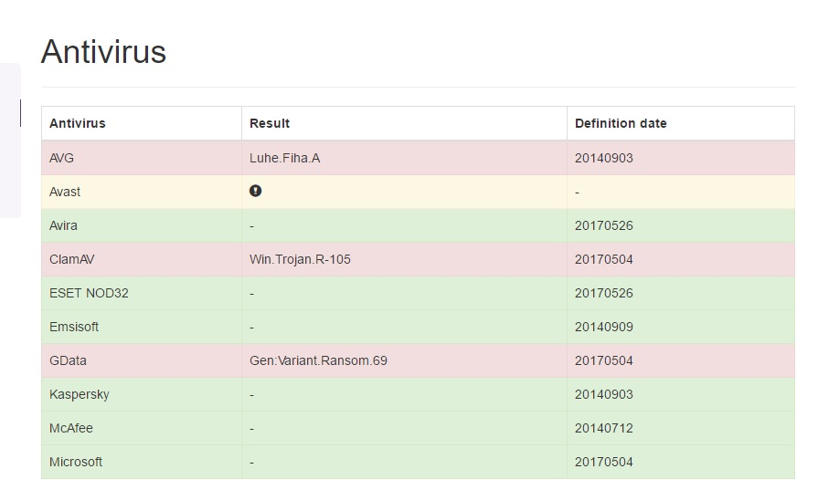

# lea
lea is a cute backdoor, it looks for available networks, including printers
and all internet connected devices, enter it self to the registry under:"SOFTWARE\\Microsoft\\Windows\\CurrentVersion\\Run"
as to run on system start-up, opens up port-8000 & listen for incoming command to execute as admin.
lea is a google software and as such it has its own digital signiture, with sha-1 on RSA.
lea passes the newest norton anti-virus scan, and doesn't ask for permission to open up ports
and to register at the windows current config. 
download lea, she's the best!

# Timeline:
<html>

Reported: May 24 17

May 27 Added to <a href="https://www.microsoft.com/security/portal/threat/encyclopedia/">Microsoft Threat Portal</a>

</html>

..

       Tested on:
       DOCID: v118291851_NortonM_Retail_1_en_us
       Operating System: Windows, Mac OS X, Android, iOS
       Last modified: 05/11/2017
       WINDOWS 10 HOME 2016 10.0*
       HP Pavilion Desktop - 510-p020
       Intel® Core™ i5-4460S Processor

<table>
<tr>
       <th>Author's</th>
       <td><a href="https://sp7.co">Numéro du projet sept sérine</a> (<a href="http://sp7.co">@Sp7</a>)</td>
    </tr>
    <tr>
        <th>Copyright</th>
        <td>2017-2020 The-Sarin-project</td>
    </tr>
    <tr>
        <th>Version</th>
        <td>0.0.1</td>
    </tr>
    <tr>
        <th>Last-Modified</th>
        <td>25.5.17</td>
    </tr>
    <tr>
    <th>additional Analysis</th>
    <th><a href="http://bit.ly/2rZUAHU">avcaesar</a></th>
    </tr>
</table>

# description
       TODO

       after running the software (not as admin or anything),
       we got a backdoor operating on port 8000,
       with the even more interesting fact:
       that we could enter our key in the registry for the worm
       consistent at the system.
       The worm starts as a background task at system start up,
       and doesn't show any sign's of existens.

       The before...

       The after..

       The latest Symantec-norton in Action!

<a href="https://sp7.co/manifest">website<a>
